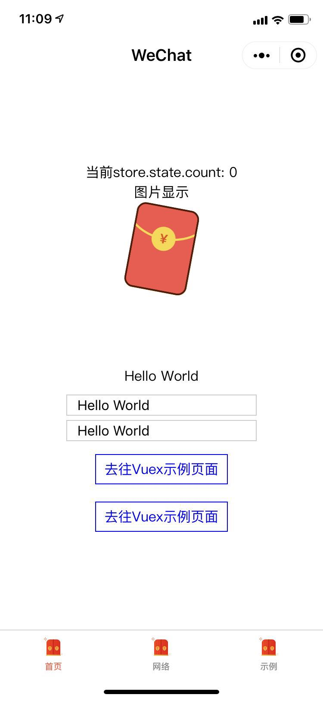
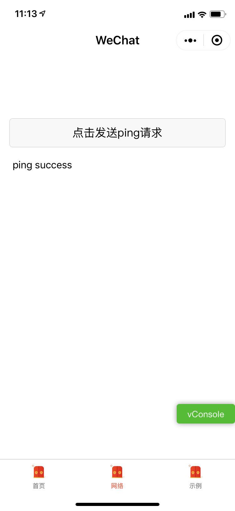
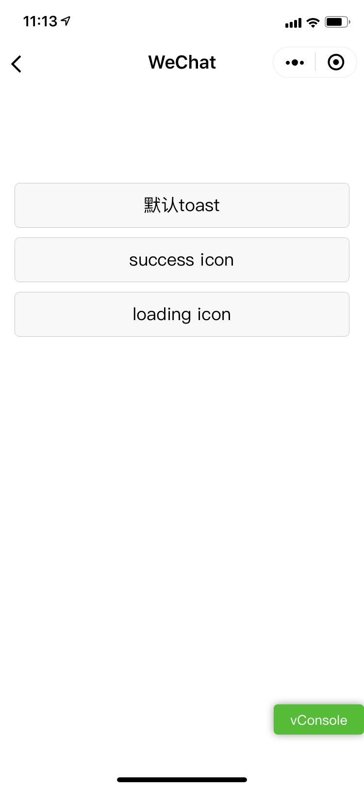
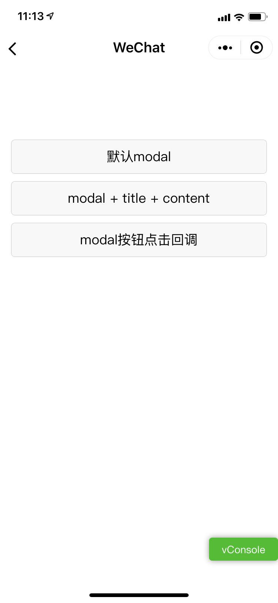

# mpvue-quickstart-demo

> A Mpvue-quickstart-template demo project

## Build Setup

``` bash
# install dependencies
npm install

# serve with hot reload at localhost:8080
npm run dev

# build for production with minification
npm run build

# build for production and view the bundle analyzer report
npm run build --report
```

For detailed explanation on how things work, checkout the [guide](http://vuejs-templates.github.io/webpack/) and [docs for vue-loader](http://vuejs.github.io/vue-loader).


## 演示功能

### UI

1.  modal 模态对话框
2.  toast 消息提示框
3.  图片显示
4.  tabBar 底部导航栏

### API

1. location 地理位置
2. 路由切换
3. request 网络请求
4. vuex


## 如图

首页 | 请求 | toast | modal
---------|----------|---------|---------
  |  |  | 